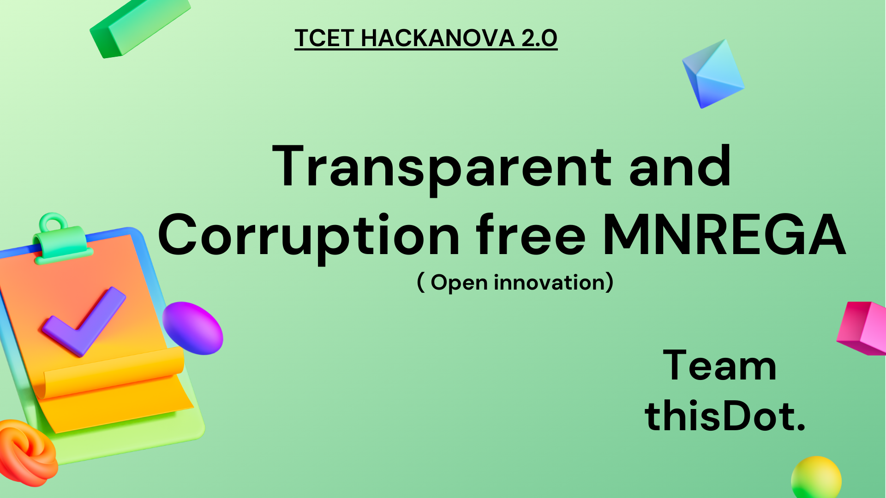
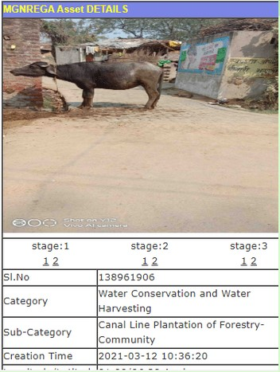
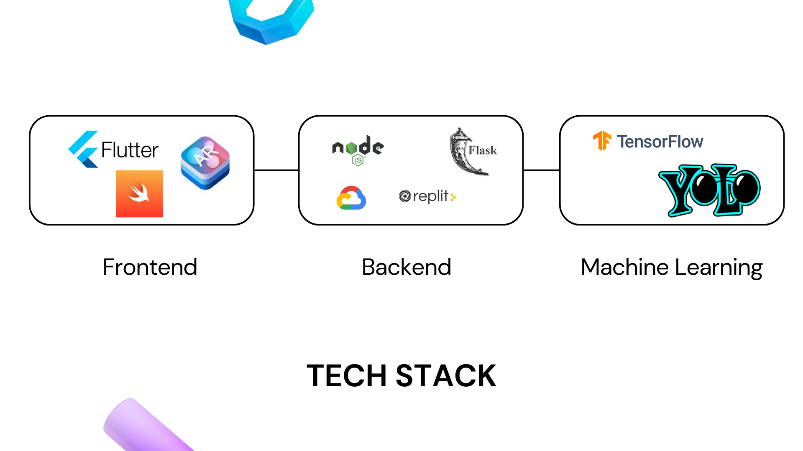
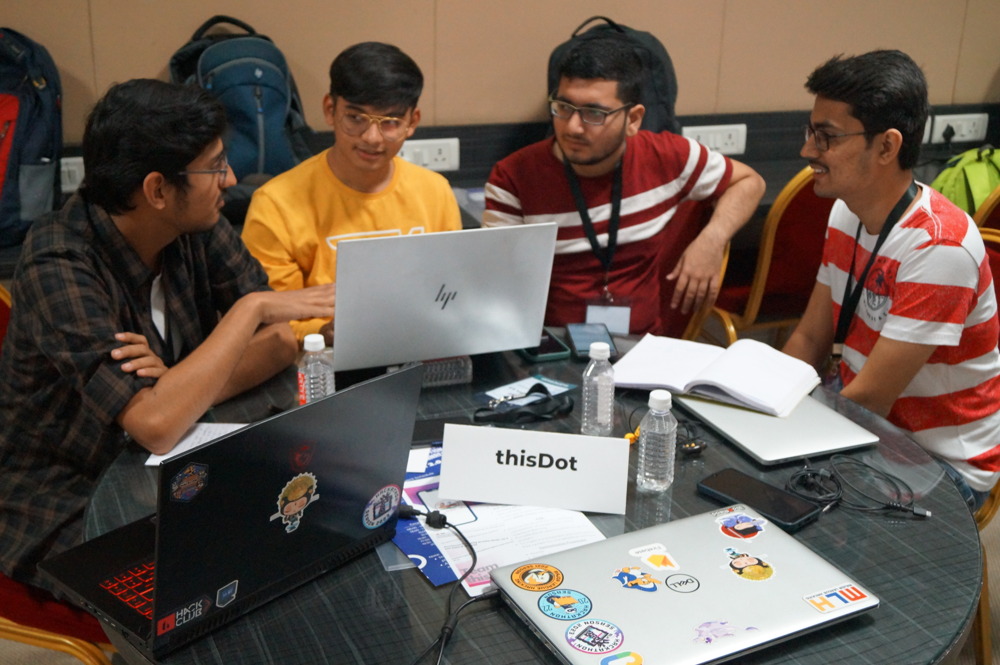

# Transparent and Corruption-free MNREGA

  
An add-on layer to current government's MNREGA system to provide a more transparent, easy-to-use and corruption-free environment.

## Summary
- built add-on layer to enhance existing MNREGA application 
- plagiarism check using object detection and classification
- utility features such as OCR and AR ruler
- impacts employment of 80 million people directly

## What is MNREGA ?
MNREGA stands for <b>Mahatma Gandhi National Rural Employment Guarantee Act</b>. It's objective is to 
- Provide 100 days of guaranteed wage employment to rural unskilled labour
- Increase economic security
- Decrease migration of labour from rural to urban areas

It gives a significant amount of control to the Gram Panchayats for managing public works, strengthening Panchayati Raj Institutions. Gram Sabhas are free to accept or reject recommendations from Intermediate and District Panchayats.
   
It incorporates accountability in its operational guidelines and ensures compliance and transparency at all levels.

## Current systemt and it's issues

### working:

Once work is allocated and workers are assigned work, The MGNREGA Spatial Enumerator (MSE) officer uploads images of progress about the project at three stages
- beginning of project
- half way through the project
- on project completion
and all these information is publicly available on governments site.

### shortcoming:

Even with all the check present in current system there are some major shortcomings such as:
- lack of check for uploaded images
- lack of ease of access
- lack of check for plagiarism

One such example of mis-happening is presented below:

You can check out all projects and their details on [Bhuvan-MGNREGA](https://bhuvan-app2.nrsc.gov.in/mgnrega/mgnrega_phase2.php) by Ministry of Rural Development.

If you will navigate to <b>Uttar Pradesh -> Faizabad</b>, you find this peculiar project where a canal line project is supposed to be built, but you can see the progress for yourself; is it correct ?

 
Faizabad, Uttar Pradesh, India

## Our Solutions

| Goal | Description |
|------|--------------|
| Transperancy | Open Database & ease of use |
| Corruption | - Object detection ML model   - classification MLmodel   - plagarism checker |
| Utility | - OCR   - Augmented Reality |

  
Our system flow

  
Tech stack

## Demo

Main app demo: https://youtu.be/Vlk-5HigI8k

AR app demo: https://youtu.be/YQYYK2wRRPM

## Event detail

We made and presented this project in <b>Hackanova 2.0 by TCET Mumbai</b> a 30 hour hackathon and won <b>1st prize</b> in the <b>Open Innovation</b> category.

  
Hackanova 2.0 - Open Innovation winners

  
Hackanova 2.0

## Team detail
- Madhav Jha: [@jhamadhav](https://github.com/jhamadhav)
- Harsheet Chordiya: [@Harsheet196](https://github.com/Harsheet196)
- Sarvesh Vyas: [@git-svyas](https://github.com/git-svyas)
- Aaditya Chaturmohta: [@aadi-byte](https://github.com/aadi-byte)
